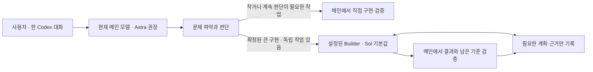

# Orchestrail

**기존 Codex 대화에서 직접 처리하고, 판단이 끝난 큰 구현만 선택적으로 위임합니다.**

Orchestrail은 모델 배정 규칙, 네 가지 역할 프로필, 버전이 있는 계획, 검증 근거, 재개 가능한 로컬 상태를 제공하는 Codex 플러그인입니다. 모델 실행과 로그인은 Codex가 담당하며, 별도 API 키나 서버가 필요하지 않습니다.

현재 버전은 **0.3.0**입니다. GitHub 배포 파일과 OpenDock 제출 패키지를 만들 수 있습니다. 패키지 생성은 저장소 공개나 레지스트리 게시를 실행하지 않습니다. 확인한 범위는 [호환성 보고서](docs/compatibility.md)를 참고하세요.

## 설치해서 사용하기

필요한 환경: Node.js 22+, Git, 플러그인·네이티브 하위 에이전트를 지원하는 Codex, 설정한 모델에 대한 계정 접근 권한. 로컬 검증 버전은 Codex CLI 0.154.0입니다.

### GitHub에서 설치

이 코드가 GitHub의 해당 ref에 게시된 뒤 실행합니다.

```bash
codex plugin marketplace add Yaklede/codex-orchestrail --ref main
codex plugin add orchestrail@orchestrail
```

게시 전에는 이 저장소에서 로컬 설치할 수 있습니다. 설치용 JavaScript가 포함되어 있어 **사용자는 pnpm install이나 빌드를 할 필요가 없습니다.**

```bash
codex plugin marketplace add /absolute/path/to/codex-orchestrail
codex plugin add orchestrail@orchestrail
```

플러그인은 현재 Codex 사용자에게 설치됩니다. 직접 처리에는 setup이 필요하지 않습니다. 관리되는 위임·상태 기록을 사용할 프로젝트에서 setup을 한 번 진행합니다. 플러그인 소스 저장소를 작업할 프로젝트에 복사할 필요는 없습니다.

### 사용할 프로젝트에서

1. 프로젝트를 Codex에서 열고 **“Orchestrail로 이 작업 해줘”**라고 요청하면 직접 처리부터 시작합니다. 위임·지속적인 상태 기록이 필요하면 **“Orchestrail 설정해줘”**로 설정합니다. 처음에는 하위 에이전트의 추론 수준을 묻습니다. 기본 혼합(Scout medium, 나머지 high), 모두 high, 직접 지정 중에서 선택하거나 원하는 설정을 말하세요. 이미 “모두 xhigh로 설정해줘”처럼 지정했다면 다시 묻지 않습니다. 스킬 선택기에서는 `orchestrail-setup`을 선택할 수 있습니다.
2. Codex에서 번들 훅을 검토하고 신뢰합니다. CLI는 `/hooks`에서 확인하세요. 설치와 훅 신뢰는 별개입니다.
3. 새 작업을 열어 프로젝트 프로필을 읽게 합니다. 메인 모델은 **Astra**를 비교 기준으로 권장하며, 추론 수준은 사용자가 선택합니다. 플러그인은 현재 메인 모델을 자동 변경하지 않습니다.
4. **“Orchestrail로 이 기능 구현하고 테스트해줘”**라고 요청하고, 같은 대화에서 수정·배포·상태 확인을 이어갑니다.

CLI 시작 예시(아래 high는 예시이며 고정 정책이 아닙니다):

```bash
cd /path/to/your-project
codex --enable hooks -m gpt-6-astra -c 'model_reasoning_effort="high"'
```

훅을 사용할 수 없는 호스트와 OpenDock 설치에서는 스킬이 상태 도구를 명시적으로 호출하고 세션 ID를 유지합니다. 이 경우 자동 상태 주입과 도구 호출 차단은 적용되지 않습니다.

## 동작 방식



| 역할 | 기본 모델 / 추론 수준 | 용도 |
| --- | --- | --- |
| Scout | Sol / medium | 코드와 제약 조사 |
| Builder | Sol / high | 구현, 테스트, 확정된 배포 절차 |
| Reviewer | Sol / high | 변경 및 근거 검토 |
| Expert | Astra / high | 설계, 호환성, 원인 판단, 계획 수정 |

- 작은 작업과 계속 판단이 필요한 작업은 현재 메인 모델이 직접 처리합니다. 직접 처리에는 별도의 run이나 관리 호출을 만들지 않습니다.
- 메인이 설계·호환성 판단을 마친 뒤, 인계·검토 비용을 감수할 만큼 구현량이 있고 부모에게 독립적인 일이 남아 있을 때만 Builder에 위임합니다. Astra 메인이라고 Astra Expert를 중복 호출하지 않습니다.
- 추적 작업은 `begin`으로 시작·계획·배정을 묶고 `finish`로 남은 검증·완료를 묶습니다. 상태 조회는 요약이 기본이며 과거 로그는 명시적으로 요청합니다. 진단 로그 추가는 작업 수정의 revision 충돌을 만들지 않습니다.
- 역할별 기본값은 위 표의 설정값이며, 위임이 항상 더 싸다는 뜻이 아닙니다. 기존 [파일럿](docs/benchmark-results-2026-09-15.md)은 과도한 관리 비용과 품질 차이를 확인했습니다.
- 자격 증명·접근 권한 같은 외부 제약은 필요한 입력을 기다립니다.
- 한 작업에서 배정은 하나씩, 같은 체크아웃의 Builder도 한 명만 허용합니다. 부모는 하위 작업과 독립적인 조사·검증 준비를 진행할 수 있습니다.
- 명령 종료 코드가 0이어도 다른 완료 기준이 실패하면 완료 처리하지 않습니다. 코드·계획·요구사항이 바뀌면 이전 검증을 그대로 재사용하지 않습니다.

## 상태, 설정, 재개

프로젝트 setup이 만드는 파일:

```text
.codex/agents/orchestrail-{scout,builder,reviewer,expert}.toml
.orchestrail/
  config.json             # 모델과 배정 한도
  install-manifest.json   # 설치 파일 소유권
  events.jsonl            # 체크섬을 가진 상태 변경 기록
  snapshot.json           # 최근 상태의 투영본
  .gitignore              # 로컬 실행 기록 제외
```

**“Orchestrail 상태 보여줘”**, **“이전 Orchestrail 작업 이어서 해줘”**로 조회·재개할 수 있습니다. 새 대화에서는 이어갈 run을 선택합니다. 같은 폴더라는 이유로 다른 대화의 작업을 자동 선택하지 않습니다. 취소된 run은 재개하지 않고 새로 시작합니다.

설정 이후에도 같은 대화에서 변경을 요청할 수 있습니다.

> Orchestrail Builder의 추론 수준을 medium으로 바꿔줘.
>
> Expert는 Astra max로 바꿔줘.
>
> Expert 모델을 Sol로 바꾸고 추론 수준은 high로 해줘.
>
> 현재 역할별 모델과 추론 설정 보여줘.

선택은 프로젝트의 `.orchestrail/config.json`과 프로필에 저장됩니다. 요청한 항목만 수정하며 다른 역할, 한도, 작업 기록과 사용자 지침은 유지합니다. 변경은 **새 배정부터 적용**됩니다. 이미 예약하거나 실행한 에이전트는 원래 설정을 유지하고, 모델이나 추론 수준이 달라지면 새 에이전트를 사용합니다. 메인 대화의 설정은 Codex에서 별도로 선택합니다. 지원되는 모델과 추론 수준은 현재 호스트의 가용 목록을 따릅니다.

기존 설정이 있는 프로젝트에서 setup을 다시 실행하면 저장된 선택을 유지합니다. 설정 조회·부분 변경 도구의 요청 형식은 [설정 프로토콜](plugins/orchestrail/references/settings.md)에 있습니다. 모델 프로필만 지원하는 호스트는 변경된 프로필을 읽기 위해 새 작업이 필요할 수 있습니다.

기본 한도는 Expert 배정 3회, 전체 계획 재작성 2회입니다. 이는 **배정 횟수 한도**이며 토큰이나 청구액의 상한이 아닙니다. 사용량에는 요청 모델과 실제 관측 모델을 구분하며, 관측하지 못한 토큰·비용은 `null`로 표시합니다.

모델·추론 변경은 프로필 상단의 해당 필드만 수정해 사용자 지침과 주석을 보존합니다. 안전하게 수정할 수 없는 프로필 형식은 오류를 반환하며, 수정 요청 없이 setup으로 파일을 갱신할 때도 사용자 편집과의 충돌을 보존합니다. 상태에는 작업 설명과 제한된 명령 출력이 저장됩니다. 출력의 흔한 비밀값 패턴을 가리지만 완전한 비밀정보 탐지기는 아니므로 실행 기록을 공개 저장소에 올리지 마세요.

## OpenDock

[OpenDock](https://opendock.app/docs/?lang=ko&theme=dark)용 프로젝트 설치 패키지도 제공합니다.

```bash
pnpm install --frozen-lockfile
pnpm package:opendock
```

결과는 `dist/opendock/dock.yml`과 payload입니다. **프로젝트 전용 스킬·프로필·런타임과 `AGENTS.md` 관리 블록**을 설치합니다. 네이티브 플러그인 훅이 필요한 경우 GitHub 플러그인 배포를 사용하세요. 두 배포 형태를 같은 프로젝트에 중복 설치하지 않는 것이 좋습니다.

OpenDock 0.2.0의 파서와 파일 관리 코드로 로컬 형식·설치·제거를 검증했습니다. 실제 게시에는 사용자가 소유한 OpenDock namespace, 인증, 심사가 필요합니다. 상세 절차는 [OpenDock 안내](opendock/DOCK.md)와 [릴리스 안내](docs/distribution.md)에 있습니다.

## 개발과 검증

```bash
pnpm install --frozen-lockfile
pnpm check
pnpm package
```

`pnpm package`는 타입 검사, 번들 생성, 테스트, 패키지 검증 후 다음 파일을 만듭니다.

- `dist/orchestrail-0.3.0.tar.gz`: GitHub marketplace와 플러그인
- `dist/orchestrail-opendock-0.3.0.tar.gz`: OpenDock 제출용 패키지
- `dist/SHA256SUMS`: 파일 체크섬

`plugins/orchestrail/scripts/orchestrail.mjs`는 GitHub 직접 설치에 필요하므로 생성 후 커밋에 포함합니다. CI는 Linux/macOS에서 검사하고 생성물의 누락된 갱신을 확인합니다.

실제 모델 호출 검증은 선택 실행이며 Codex 사용량을 소비합니다.

```bash
pnpm smoke:native   # Sol/Astra 모델 및 네이티브 이벤트 확인
pnpm smoke:harness  # 배정 → 실제 모델 → 결정 → 검증 → 완료
pnpm smoke:settings # 첫 설정 질문과 이후 자연어 설정 변경
```

0.3.0 실제 모델 비교는 [검증 결과](docs/benchmark-results-2026-09-15-v03.md)에 기록했습니다. 동일한 작업의 토큰 효율을 비교하는 선택 실행 도구는 [벤치마크 안내](docs/benchmarking.md)에 있습니다. 단일 실행으로 일반적인 절감률을 주장하지 않으며, 메인·하위 에이전트 사용량과 결과 검증을 함께 기록합니다.

참고: [상세 설계](docs/implementation-plan.md) · [현재 구조](docs/architecture.md) · [호환성](docs/compatibility.md) · [기여 안내](CONTRIBUTING.md)

## 제거

프로젝트에서 **“Orchestrail 프로젝트 설정 제거해줘”**라고 요청하면 변경하지 않은 소유 프로필만 제거하고 실행 기록은 남깁니다. 이어서 플러그인을 제거합니다.

```bash
codex plugin remove orchestrail@orchestrail
```

OpenDock으로 설치한 파일은 OpenDock에서 제거합니다. 자세한 내용은 해당 배포 안내를 따르세요.

## 라이선스

[MIT](LICENSE). 번들에 포함된 Zod의 고지는 [THIRD_PARTY_NOTICES.md](THIRD_PARTY_NOTICES.md)에 있습니다.
