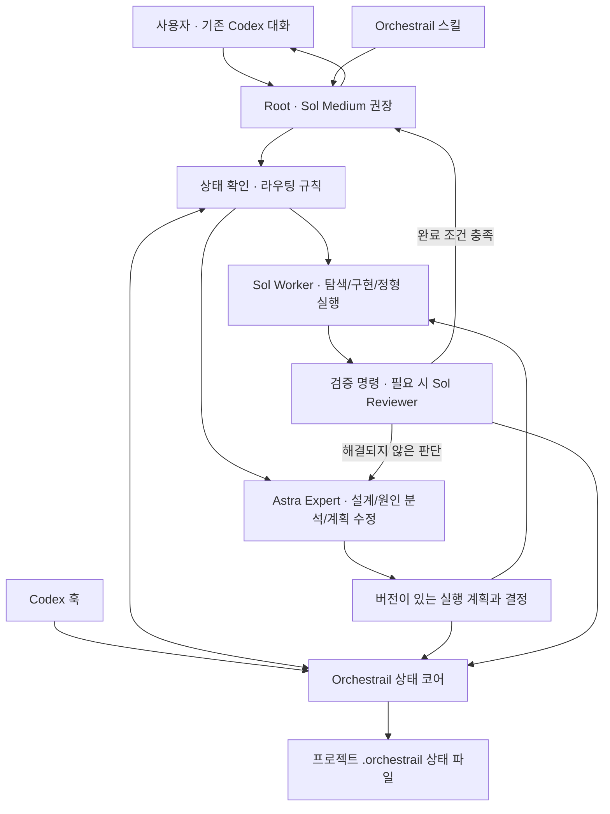

> 0.3.0 변경: 직접 실행 기본, 판단 후 선택적 위임, compact status, control revision, begin/finish를 구현했습니다. 아래 초기 계획의 Sol 메인 권장은 대체되었습니다. 현재 동작은 [구조 문서](architecture.md)를 따릅니다.

# Orchestrail 구현 계획

- 작성일: 2026-09-15
- 상태: 0.2.0 설정 선택·변경 기능 구현, GitHub 소스 배포 및 OpenDock 제출 준비
- 대상 저장소: `Yaklede/codex-orchestrail`

## 구현 결과와 설계에서 달라진 점

이 문서는 착수 시 세운 상세 계획을 보존한다. 현재 사용법은 [README](../README.md), 실제 구현 구조는 [architecture.md](architecture.md), 검증 범위는 [compatibility.md](compatibility.md)가 기준이다. 아래 단계별 완료 기준에는 향후 앱 온보딩 검증과 공개 게시도 포함되어 있으며, 모든 후보 기능을 이미 구현했다는 뜻은 아니다.

- **구현:** 네 가지 스킬/역할, Sol/Astra 라우팅, 버전 계획·결정, 검증 근거, 반복 수정 실패 집계, 배정 한도, 중단/취소/재개, 설치 소유권 관리, 훅 어댑터.
- **0.2.0 설정:** 최초 setup에서 사용자의 추론 수준 선택을 받고, 이후 자연어 요청으로 역할별 모델·추론을 변경한다. 변경은 새 배정부터 적용하며 기존 배정·기록은 유지한다. 실제 요청 형식은 [설정 프로토콜](../plugins/orchestrail/references/settings.md)을 따른다.
- **실모델 확인:** Codex CLI 0.154.0에서 Sol 탐색 → Astra 판단 → 검증 → completed를 통과했다. 요청 모델과 SubagentStart의 관측 모델을 대조했다.
- **단순화:** 상태는 checkout별 `events.jsonl`과 `snapshot.json`에 함께 보관한다. 별도 per-run 디렉터리·RepositoryBrief·Artifact DB·projectId 계층은 만들지 않았다.
- **훅:** 네이티브 도구 별칭과 불투명한 메시지 payload에 대응하도록 고유 taskName을 사용한다. 루트 Stop은 경고만 제공한다. 압축 복구는 SessionStart의 compact 이벤트와 기존 기록으로 처리한다.
- **배포:** 사용자 결정에 따라 GitHub repo marketplace와 릴리스 압축 파일을 준비했다. OpenDock 프로젝트 설치 패키지도 추가했으며 실제 게시 요청 없이 설치·제거 동작을 검증했다.
- **남은 외부 검증:** 새 데스크톱 작업에서 스킬 선택·프로필 발견·사용자 훅 신뢰를 포함한 온보딩, Linux CI 실행, OpenDock 심사와 공개 설치. 비용 절감률과 토큰 과금 상한은 주장하지 않는다.

## 1. 제품 목표와 확정된 방향

**사용자는 기존 Codex 앱/CLI의 한 대화에서 작업을 계속하고, Orchestrail은 Sol을 실행에, Astra를 어려운 의사결정에 배정한다.**

사용자가 선택한 첫 버전은 **Codex 설정·플러그인 방식**이다. 사용자 인터페이스와 에이전트 실행은 Codex가 담당한다. Orchestrail은 스킬, 네이티브 하위 에이전트 설정, 작업 상태 저장, 라우팅 규칙, 훅을 제공한다.

핵심 사용자 경험:

```text
사용자: Orchestrail로 이 프로젝트에 주문 취소 기능 구현해줘.
Codex:  기존 구조 확인 → 필요 시 설계 → 구현 → 검증 → 결과 보고

사용자: 재시도 횟수를 5번으로 바꿔.
Codex:  기존 결정과 변경 범위 확인 → Sol 구현 → 검증

사용자: 이제 배포해.
Codex:  배포 절차와 변경 사항 확인 → 필요한 판단/실행 역할 배정 → 결과 확인
```

내부 에이전트 활동은 Codex가 표시할 수 있다. “한 세션”은 사용자가 여러 대화를 직접 관리하지 않아도 된다는 뜻이며, 내부 작업이 모두 하나의 모델 컨텍스트에 들어간다는 뜻은 아니다.

### 착수 당시 저장소와 개발 환경

- `.git`만 있는 빈 저장소이며 최초 커밋이 없다.
- 원격: `git@github.com:Yaklede/codex-orchestrail.git`.
- 기본 브랜치: `main`.
- 적용 가능한 상위/저장소 `AGENTS.md`는 발견되지 않았다.
- 로컬 Codex CLI: `0.154.0`.
- 로컬 Node.js: `22.14.0`, pnpm: `11.5.0`.
- 이후 구현과 검증을 진행했다. 실제 결과와 한계는 위 구현 결과 및 호환성 보고서에 기록했다.

## 2. 공식 지원 범위와 설계 경계

| 항목 | 확인한 내용 | Orchestrail 설계 |
| --- | --- | --- |
| 모델별 하위 에이전트 | 커스텀 에이전트에 모델·추론 수준 지정 가능 | 역할별 TOML 템플릿 제공 |
| 자동 위임 | 적용 중인 스킬/AGENTS.md의 위임 지침을 따를 수 있음 | 활성화 스킬에 위임 조건을 명시 |
| 에이전트 배치 | 프로젝트 `.codex/agents/` 또는 개인 `~/.codex/agents/` | 프로젝트 설치를 기본으로 하고 기존 파일 보존 |
| 플러그인 구성 | 스킬·스크립트·훅을 묶어 배포 가능 | Codex 호환 manifest 사용 |
| 도구 관찰·제어 | 지원되는 로컬 도구에 PreToolUse/PostToolUse 적용 | 에이전트 배정·실행 결과·상태 갱신 연결 |
| 호출 제어 범위 | 일부 도구 경로는 훅 대상에서 제외될 수 있음 | 전체 실행/비용을 완전히 통제한다고 보장하지 않음 |
| 훅 신뢰 | 설치와 별개로 훅 정의를 검토·신뢰해야 실행됨 | 설치 진단에서 신뢰 여부와 미동작 기능 표시 |
| 대화 기록 | 훅의 transcript 파일 형식은 안정된 인터페이스가 아님 | 내부 transcript 파싱을 핵심 의존성으로 사용하지 않음 |

근거: [Subagents](https://learn.chatgpt.com/docs/agent-configuration/subagents), [Hooks](https://learn.chatgpt.com/docs/hooks), [Plugin packaging](https://developers.openai.com/plugins/build/plugins).

### 메인 모델에 대한 결정

- 권장 메인 모델은 `gpt-5.6-sol`, reasoning `medium`이다. 이는 비용을 고려한 **이 프로젝트의 초기 정책**이다.
- 앱에서는 사용자가 모델 선택기로 설정한다. CLI는 시작 시 모델과 추론 수준을 지정할 수 있다.
- 플러그인이 이미 실행 중인 메인 대화의 모델을 자동 변경한다고 가정하지 않는다.
- 사용자가 Astra를 메인으로 선택했다면 하위 작업을 Sol에 배정해도 메인 작업에는 Astra 사용량이 발생한다. 상태 화면에 이를 구분한다.
- CLI 시작 예시는 다음과 같다. 기존 로그인과 사용자 권한 설정은 Codex가 처리한다.

```bash
codex -m gpt-5.6-sol -c 'model_reasoning_effort="medium"'
```

로컬 CLI의 `--model`, `--config`와 두 모델의 명시적 하위 배정을 확인했다. 모든 계정의 모델 가용성이나 데스크톱 설정 반영까지 일반화하지 않는다.

### 설치만으로 해결되지 않는 부분

플러그인 안에 둔 `agents/*.toml`이 자동 등록된다고 가정하지 않는다. 공식 문서가 보장하는 `.codex/agents/`에 설치하는 setup 절차를 제공한다. 지원 버전에서 직접 번들 로딩이 확인되면 나중에 설치 단계를 줄인다.

전체 제어를 담당하는 별도 App Server 클라이언트는 이번 MVP에 포함하지 않는다. 공식 문서상 App Server는 별도 클라이언트를 만들 때 적합하며, SDK는 자동화 작업에 적합하다. 이 선택지는 향후 독립 실행 모드가 필요해질 때 검토한다. [Codex SDK](https://learn.chatgpt.com/docs/codex-sdk), [App Server](https://learn.chatgpt.com/docs/app-server).

## 3. 전체 구조



### 책임 분리

1. **Codex:** 로그인, 모델 호출, 컨텍스트 관리, 하위 에이전트 실행, 파일 편집, 터미널, 사용자와의 대화.
2. **스킬:** 요청 해석, 역할 배정 절차, 필요한 산출물, 후속 작업과 중단 조건.
3. **에이전트 템플릿:** 실제 모델·effort·역할 지침·파일 접근 범위.
4. **상태 코어:** 스키마 검증, 상태 전이, 실패 집계, 계획 버전, 실행 증거, 사용량 집계.
5. **훅:** 활성 세션 식별, 상태 주입, 지원 도구 호출 제어·관찰, 에이전트 시작/종료 기록.

스킬은 실행 절차를 안내하고, 상태 코어는 기록의 일관성을 검증한다. 일반 shell 접근까지 가진 에이전트에 대해 이 구조를 독립적인 보안 경계로 취급하지 않는다.

## 4. 역할과 모델 정책

| 역할 | 모델 / effort | 책임 | 기본 파일 접근 |
| --- | --- | --- | --- |
| Root | Sol / medium 권장 | 사용자 의도, 상태 확인, 배정, 통합 보고 | 기존 Codex 설정 |
| Scout | Sol / medium | 관련 코드·명령·의존성·변경 위험 조사 | 읽기 |
| Builder | Sol / high | 계획 구현, 테스트, 국소적인 수정 | 작업 공간 쓰기 |
| Reviewer | Sol / high | 변경 검토, 완료 근거 확인 | 읽기 |
| Architect | Astra / high | 새로운 구조·계약·불변 조건 결정 | 읽기 |
| Escalation Expert | Astra / high | 실패 원인 판단, 계획 유지/수정/재작성 | 읽기 |
| Deployment Worker | Sol / high | 확정된 배포 절차 수행, 상태 확인 | Codex 권한에 따름 |
| Deployment Expert | Astra / high | 호환성·순서·복구 전략 판단 | 읽기 |

구현 시에는 중복을 줄여 `orchestrail-scout`, `orchestrail-builder`, `orchestrail-reviewer`, `orchestrail-expert` **4개 프로필**부터 시작한다. Architect/장애/배포 전문가는 expert 프로필에 작업별 지침을 전달한다. 정형 배포는 builder를 재사용한다.

예상 에이전트 파일:

```toml
name = "orchestrail-expert"
description = "Resolve architecture decisions and blocked implementation plans."
model = "gpt-6-astra"
model_reasoning_effort = "high"
sandbox_mode = "read-only"
developer_instructions = """
Read the assigned decision packet and relevant evidence.
Return a structured decision: KEEP_PLAN, PATCH_PLAN, REPLAN, or NEEDS_INPUT.
Identify affected invariants, plan steps, and acceptance criteria.
Do not delegate recursively or change implementation files.
"""
```

프로필은 모델과 effort를 함께 지정한다. 모델을 사용할 수 없으면 대체 모델로 조용히 바꾸지 않고 상태에 사유를 기록한다. 사용자가 설정한 fallback이 있을 때만 그 정책을 적용한다.

### 위임의 크기

- 이미 알고 있는 위치의 매우 작은 변경은 Root가 직접 처리할 수 있다. 모델 호출과 컨텍스트 복사의 비용을 줄인다.
- Builder는 “파일 하나”보다 **검증 가능한 작업 단계 하나**를 맡는다.
- Root는 다음 단계 검토, 계획 정리 등 독립 작업을 진행하면서 하위 작업을 기다린다. 호스트가 허용하는 위임 조건을 준수한다.
- 쓰기 작업자는 기본 1명이다. 읽기 병렬화와 여러 worktree의 병렬 구현은 MVP 이후다.
- 하위 에이전트의 재귀 위임은 역할 지침에서 금지한다. 실제 차단은 호스트 훅에서 식별 가능한 범위만 적용한다.

## 5. 라우팅 규칙

### 분류 입력

자연어 요청만 보지 않고 다음 증거를 함께 사용한다.

- 현재 목표, 이전 계획·결정, 사용자 제약.
- Git 기준 상태, 변경 파일, 관련 심볼/모듈.
- 검증 명령과 최근 실패, 시도한 수정.
- API·DB·권한·트랜잭션·배포 호환성에 관한 **미해결 결정**.
- 사용할 수 있는 모델, 현재 할당량, 남은 배정 횟수.

### 초기 규칙표

| 상황 | 경로 | 판단 기준 |
| --- | --- | --- |
| 단순 문구/설정 수정 | Root 또는 Sol Builder | 변경 범위와 검증 방법이 명확 |
| 기존 패턴 확장 | Sol Scout → Builder | 새 구조 결정이 없음 |
| 새 프로젝트 | Sol Scout → Astra Architect → Sol Builder | 실행 가능한 구조와 첫 구현 패턴이 필요 |
| 아키텍처 변경 | Astra → Sol | 공용 계약·데이터 모델·불변 조건의 변경 |
| 원인이 명확한 테스트 실패 | Sol 수정 | 계획 범위 안에서 해결 가능 |
| 같은 원인 수정 2회 실패 | Astra 진단 → Sol | 확인된 수정 시도와 실패 근거 존재 |
| 네트워크/인증/도구 부재 | 환경 문제 처리 또는 대기 | 지능을 높여도 해결되지 않는 조건 |
| 정형 배포 | Sol Worker | 기존 절차와 성공 기준·실패 대응이 확인됨 |
| 복합 배포 | Astra Expert → Sol Worker | 버전 혼재, migration 호환성, 순서/rollback 판단이 미해결 |

“production이면 무조건 Astra”, “시스템 3개면 Astra”는 초기 규칙으로 사용하지 않는다. 기존 runbook으로 충분한지와 해결되지 않은 결정이 있는지가 기준이다. 모델 난이도 판단과 실행 권한은 별개다.

### 실패 횟수의 정의

`sameFailureCount >= 2`는 **동일 원인을 고치려는 두 번의 수정 시도 후에도 검증이 실패한 경우**다.

- 최초 실패는 기준 증거이며 수정 시도 1회로 세지 않는다.
- 같은 명령을 재실행하거나 로그를 polling한 것은 추가 수정 시도가 아니다.
- 실패 식별자는 검증 항목 ID, 명령, 정규화한 오류, 관련 코드 범위를 사용한다.
- timestamp·절대 임시 경로 등 변동 문자열은 제거한다. 서로 다른 오류를 합치지 않는다.
- 패키지 다운로드 장애, 인증 문제, 환경 누락은 별도 분류한다.
- 판별이 애매하면 같은 실패라고 단정하지 않고 모델 판단과 원문 증거를 남긴다.

### Escalation 결과

- `KEEP_PLAN`: 계획은 유효하며 구현 수정 방향을 제공.
- `PATCH_PLAN`: 영향받는 단계·결정·검증 조건만 새 버전으로 변경.
- `REPLAN`: 기존 단계의 재사용 가능 여부까지 포함해 계획 재구성.
- `NEEDS_INPUT`: 빠진 요구사항, 접근 권한, 환경 문제 등 외부 입력 필요.

계획 수정 뒤에는 “다시 Sol”로 내려오며, 같은 증거로 Astra를 반복 호출하지 않는다.

## 6. 상태 모델과 산출물

### 식별자

- `projectId`: 정규화한 저장소 위치와 Git common directory를 바탕으로 생성.
- `workspaceId`: 실제 checkout/worktree 경로를 구분.
- `sessionId`: Orchestrail이 관리하는 사용자 작업 세션.
- `nativeSessionId`: 훅에서 받은 Codex 세션 ID. 임의의 경로/제목에서 추측하지 않는다.
- `runId`: 사용자 목표 하나. 같은 대화에 여러 run이 이어질 수 있다.
- `assignmentId`: 에이전트에게 배정한 작업 단위.
- `nativeAgentId`, `nativeTurnId`: 지원되는 이벤트에서 확인한 실행 식별자.

동일 디렉터리의 여러 Codex 대화가 `current-run.json` 하나를 공유하지 않도록 세션별 매핑을 사용한다. 각 checkout의 활성 쓰기 작업에는 별도 lease를 둔다.

### 현재 저장 구조

```text
<사용 대상 프로젝트>/
├── .codex/agents/orchestrail-*.toml
└── .orchestrail/
    ├── config.json
    ├── install-manifest.json
    ├── events.jsonl       # 세션 매핑과 run별 기록을 포함한 상태 변경 이력
    ├── snapshot.json      # 가장 최근 상태의 투영본
    ├── write.lock         # 변경 처리 중에만 존재
    └── .gitignore
```

에이전트 설정은 팀 공유가 가능하다. `.orchestrail/` 전체는 기본적으로 로컬 상태이며 Git 추적에서 제외한다. 설치 도구는 기존 ignore 규칙과 사용자 파일을 보존하고 소유한 항목만 관리한다.

### 주요 계약

| 산출물 | 필수 내용 |
| --- | --- |
| Task | 목표, 범위, 제약, 사용자 요청 revision, 완료 기준 |
| RepositoryBrief | 기준 HEAD/dirty 상태, 관련 파일, 검증 명령, 확인된 사실/불확실성 |
| ExecutionPlan | 버전, 선행 계획, 불변 조건, 결정 ID, 단계·의존성·변경 범위·검증 항목 |
| Assignment | 역할, 요청 모델/effort, planVersion, 대상 단계, 종료 조건, 실행 식별자 |
| AgentResult | completed/blocked/escalate, 변경·판단 요약, evidence ID, 미해결 사항 |
| DecisionPacket | 목표, 관련 계획/결정, 필요한 diff, 실패·수정 시도, 질문, 불확실성 |
| Decision | 결과 유형, 이유, 영향 범위, 대안, 검증 조건, 증거 |
| Evidence | 명령·cwd·종료 코드·시간·파일/코드 상태·로그 위치·완료 기준 ID |
| Usage | 배정 횟수, 모델/effort, 관측 가능한 token/시간, 수집 출처와 관측 범위 |

위 계약 표는 설계 시 검토한 정보 범위다. 현재 설정·상태에는 `schemaVersion`을 두고, 개별 입력은 해당 Zod 계약으로 검증한다. 실제 요청 모양은 [runtime protocol](../plugins/orchestrail/references/protocol.md)을 따른다. 모델에 출력 수정을 요청하는 횟수도 제한한다.

### 계획 계약의 최소 예시

```json
{
  "schemaVersion": 1,
  "runId": "run-example",
  "version": 1,
  "goal": "기존 주문 취소 API에 재시도 정책 추가",
  "invariants": ["동일 취소 요청의 중복 처리를 방지한다"],
  "decisions": ["decision-0001"],
  "steps": [
    {
      "id": "step-1",
      "dependsOn": [],
      "role": "builder",
      "objective": "기존 정책에 맞춰 재시도와 검증을 추가한다",
      "changeScope": ["조사에서 확인한 정책 모듈", "관련 테스트"],
      "acceptanceCriteria": [
        {"id": "AC-1", "description": "중복 요청은 한 번만 처리된다", "verification": "automated"}
      ]
    }
  ]
}
```

실제 계획에는 조사로 확인한 파일·명령을 기록한다. 위 예시의 설명형 경로를 그대로 실행 대상으로 사용하지 않는다. Builder는 계획을 수정하지 않고 필요 변경을 제안하며, Root가 검증한 새 버전만 활성화한다.

## 7. 작업 수명과 복구

```text
received → scouting → routing → planning(optional) → implementing → verifying → completed
                                              ↑           ↓              ↓
                                              └── replanning ← escalating

비종료 상태 → waiting_for_input | waiting_for_permission | paused | failed | cancelled
```

- `completed`는 모든 필수 완료 기준이 증거에 연결되어 있고 해당 코드 상태에서 검증된 경우에만 허용한다.
- “에이전트가 끝났음”, “프로세스 종료 코드가 0임”만으로 목표 완료를 선언하지 않는다.
- 검증되지 않은 수동 항목은 pending으로 남긴다. 사용자가 범위를 명시적으로 바꾸면 기준 revision을 변경한다.
- 계획 버전이 바뀌면 영향받는 검증 증거를 다시 확인한다. 단순히 이전 PASS를 복사하지 않는다.
- 중단·compaction·재개 시 task, 계획, 결정, 증거, 다음 단계를 읽고 현재 Git 상태와 비교한다.
- 사용자가 같은 대화에서 정정하면 task revision을 올리고 영향받는 배정을 조정한다.
- 종료된 하위 에이전트 ID가 다시 살아난다고 가정하지 않는다. 새 에이전트가 저장된 packet으로 이어받을 수 있어야 한다.
- 사용자 취소/중단은 자동 재개하지 않는다. 모델 사용 제한도 무한 재시도로 처리하지 않는다.

### 파일 저장과 일관성

MVP는 JSON + JSONL로 시작한다. SQLite와 별도 서버는 필요성이 확인된 뒤 도입한다.

- 상태 갱신은 공통 코어를 통한다. `expectedRevision`으로 오래된 갱신을 거절한다.
- 실행별 lock에서 이벤트 append를 직렬화하고 고유 event ID로 중복 이벤트를 제거한다.
- `events.jsonl`을 상태 전이의 기준으로 삼고 snapshot은 같은 디렉터리의 임시 파일과 atomic rename으로 교체한다.
- crash 후 마지막 미완성 JSONL 레코드를 탐지하고 검증된 이벤트까지만 복원한다.
- artifact를 먼저 완결 저장한 다음 참조 이벤트를 남긴다. 유실/미참조 artifact를 진단할 수 있게 한다.
- lock 소유자 종료 여부, stale lease, 이전 코드 상태를 확인한 뒤 복구한다. 시간만 보고 진행 중인 작업의 lock을 빼앗지 않는다.

Git checkpoint는 HEAD, index/working-tree 상태, diff와 미추적 파일 목록을 기록한다. 무단 commit·reset·stash로 checkpoint를 만들지 않는다. 복구 시 사용자의 후속 변경을 덮어쓰지 않는다.

## 8. 스킬과 훅의 구체적인 동작

### 제공 스킬

1. `orchestrail-setup`: 진단, 프로젝트 설정/프로필 설치, 설치 파일 목록 기록, 업그레이드/제거 안내.
2. `orchestrail`: 현재 작업을 활성화하고 라우팅 → 배정 → 검증을 진행. 작업 활성화 뒤 일반 후속 요청도 같은 세션 상태를 사용.
3. `orchestrail-status`: 목표, 단계, 배정 모델, escalation 이유, 검증 결과, 사용량 관측 범위를 표시.
4. `orchestrail-resume`: 저장된 run과 현재 Git 상태를 대조해 이어가기.

정확한 플러그인/스킬 호출 표기는 설치 후 각 클라이언트의 스킬 선택기에서 검증한다. 사용자가 매 단계마다 스킬명을 반복해야 하는 UX는 피한다.

### 훅 매핑

| 훅 | 구현할 동작 | 제한/주의 |
| --- | --- | --- |
| SessionStart | nativeSessionId와 workspace 연결, 활성 작업 요약 주입 | 활성화하지 않은 프로젝트에는 작업 상태를 만들지 않음 |
| UserPromptSubmit | 현재 run·계획·중단 상태를 짧게 주입 | 새 사용자 입력을 자동으로 새 목표라고 단정하지 않음 |
| PreToolUse: Agent/spawn_agent | 배정과 모델·역할 대조, 횟수 예약, 지원 범위에서 거부 | 실제 tool schema는 P0에서 확인; SubagentStart로 대체 불가 |
| PostToolUse: spawn/후속 배정 도구 | nativeAgentId 연결, 예약 확정/실패 정리 | 응답·중복 전달·불명확한 실패를 구분 |
| SubagentStart | 실관측 모델, 역할, agent ID 기록; packet 위치 주입 | `continue:false`로 시작을 막을 수 없음 |
| PostToolUse: Bash/apply_patch | 명령 결과·파일 변경 근거 수집 | 명령 실행 후 결과이므로 변경을 취소할 수 없음 |
| SubagentStop | 결과 계약과 증거 검사 | 누락 수정은 제한적으로 요청; 무한 continuation 금지 |
| Stop | active run이 남아 있음을 경고 | 자동 재실행·예약 실행 없음 |
| SessionStart source=compact | 기록에서 기존 상태 요약 복원 | 메모리 속 내용을 자동 추출한다고 가정하지 않음 |
| Interrupt/SessionEnd | run을 paused로 기록하고 살아 있는 자식의 소유권 유지 | 부모 중단이 자식 종료의 증거는 아님 |

공식 훅 문서에 따르면 `Agent`는 `spawn_agent`의 matcher 별칭이고, `PreToolUse`는 지원 도구를 거부할 수 있다. `SubagentStart`는 시작 차단 용도가 아니다. [Hooks: tool coverage](https://learn.chatgpt.com/docs/hooks#tool-coverage).

### 훅 구현 원칙

- 모델 호출이나 네트워크 작업을 훅 안에서 수행하지 않는다.
- bundled JS를 실행하며, 훅 실행마다 패키지 설치를 요구하지 않는다.
- 입력·출력은 문서화된 JSON 계약으로 처리한다. 실제 payload fixture는 지원 버전에서 수집한다.
- plugin root는 문서화된 `PLUGIN_ROOT`를 사용하고 공백 경로를 지원한다.
- 중복 훅, concurrent event, 세션 간 상태 충돌을 테스트한다.
- 활성 Orchestrail 작업이 없으면 빠르게 no-op한다.
- 정상 훅은 짧은 시간 내 종료하도록 설계한다. 단순 로깅 실패와 배정 제어 실패를 다르게 처리한다.
- 예상하지 못한 schema는 진단한다. 훅 자체 오류가 host에서 도구 실행을 막는다고 가정하지 않는다.
- spawn 외에 기존 에이전트에 보내는 후속 작업도 배정 횟수에 포함한다. 실제 도구 이름과 hook coverage는 P0에서 확인한다.
- hook의 session/turn/agent ID가 어떤 관계인지 확인한 뒤 연결한다. 공통 session ID만으로 부모·자식을 구분하지 않는다.

## 9. 사용량과 비용 관리

초기 목표는 **Astra에 배정하는 작업과 중복 컨텍스트를 줄이는 것**이다. 고정적인 절감률이나 Sol/Astra 사용 비율은 보장하지 않는다.

### 초깃값 제안

```json
{
  "schemaVersion": 1,
  "routing": {
    "routineMode": "sol-first",
    "greenfieldPlanning": "expert",
    "failedFixAttemptsBeforeEscalation": 2
  },
  "limits": {
    "maxExpertAssignmentsPerRun": 3,
    "maxReplansPerRun": 2,
    "maxConcurrentWriters": 1,
    "maxStopCorrectionsPerTurn": 1
  }
}
```

- expert assignment는 **spawn 수만이 아니라 후속 판단 요청도 포함**한다. 모델 내부 추론/API 요청 횟수와는 다르다.
- 배정 전 예약과 결과 후 확정으로 중복 호출을 줄인다. 이미 시작했는지 모르는 실패는 사용되지 않았다고 가정하지 않는다.
- 초기 packet 크기는 문서/로그의 바이트·문자 수 상한으로 관리하고 중요한 정보가 잘렸음을 표시한다. tokenizer 없이 정확한 토큰 수라고 표시하지 않는다.
- 전체 대화를 복제하기보다 목표, 관련 계획·결정, 필요한 diff, 실패 근거, 질문을 전달한다.
- `requestedModel`과 관측 가능한 `actualModel`을 별도로 기록한다. 모르면 unknown이다.
- 네이티브 hook만으로 token/청구액을 완전히 수집할 수 있다고 가정하지 않는다. 가용한 공식 이벤트가 확인될 때만 선택적으로 연결한다.
- 구독 사용량, API token 추정 금액, 실제 청구액은 다른 값이다. 구독 사용량을 API 가격으로 환산해 청구액처럼 표시하지 않는다.
- 한도 도달 시 해결 상태와 다음 선택지를 남기고 pause한다. 승인된 fallback/추가 예산 정책이 있을 때만 계속한다.

## 10. 구현 스택과 저장소 구조

### 스택 제안

- Node.js 22 이상, TypeScript.
- pnpm workspace. 초기에는 런타임 패키지 하나와 플러그인 번들 하나만 둔다.
- Zod: 설정·계획·결과·이벤트 검증.
- Vitest: 코어, hook payload, 설치/복구 테스트.
- JSON/JSONL: 로컬 상태. Node 파일 시스템과 Git CLI 활용.
- 번들러로 배포용 JS 생성. 개발 소스와 테스트가 설치된 플러그인의 실행 의존성이 되지 않게 한다.

구체적인 라이브러리 버전은 구현 시작 시 호환 버전으로 고정한다. 모델 SDK, 자체 대화 UI, 상시 daemon, MCP 서버는 초기 필수 구성에 넣지 않는다.

```text
codex-orchestrail/
├── README.md
├── LICENSE
├── CONTRIBUTING.md
├── package.json
├── pnpm-workspace.yaml
├── docs/
│   ├── implementation-plan.md
│   ├── compatibility.md
│   ├── architecture.md
│   └── adr/
├── plugins/orchestrail/
│   ├── .codex-plugin/plugin.json
│   ├── skills/
│   │   ├── orchestrail-setup/SKILL.md
│   │   ├── orchestrail/SKILL.md
│   │   ├── orchestrail-status/SKILL.md
│   │   └── orchestrail-resume/SKILL.md
│   ├── templates/agents/orchestrail-*.toml
│   ├── hooks/hooks.json
│   └── scripts/orchestrail.mjs
├── packages/runtime/
│   ├── src/contracts/
│   ├── src/state/
│   ├── src/routing/
│   ├── src/context/
│   ├── src/hooks/
│   ├── src/install/
│   └── src/cli.ts
├── tests/
│   ├── unit/
│   ├── integration/
│   ├── fixtures/
│   └── acceptance/
└── .github/workflows/ci.yml
```

`src/cli.ts`는 스킬/훅이 호출하는 로컬 관리 도구다. 사용자가 별도 대화 클라이언트로 전환할 필요는 없다.

예상 내부 명령: `doctor`, `setup`, `activate`, `status`, `plan put`, `assignment reserve`, `assignment finish`, `evidence add`, `resume`, `hook <event>`.

### 배포 구조

- plugin-creator가 지원하는 `.codex-plugin/plugin.json` 호환 레이아웃부터 사용한다.
- 훅은 기본 발견 경로 `hooks/hooks.json`에 두어 manifest 호환 차이를 줄인다.
- 에이전트 TOML은 templates에 두고 setup이 대상 프로젝트에 설치한다.
- 빌드 산출물이 실제 배포 패키지/버전 ref에 포함되는지 검증한다. 테스트에는 소스 checkout이 아닌 설치된 bundle을 사용한다.
- 사용자 요청에 맞춰 개발·GitHub 배포 모두 repo marketplace `.agents/plugins/marketplace.json`을 사용한다. OpenDock 패키지는 별도의 프로젝트 로컬 배포다.
- 제거/업그레이드는 install manifest와 checksum으로 Orchestrail 소유 파일만 처리한다. 사용자가 편집한 파일은 보존한다.
- MIT 라이선스와 번들 Zod의 라이선스 고지를 포함한다.

## 11. 단계별 구현 계획

### P0. 호환성 검증 — 구현 방향을 확정하는 첫 단계

**산출물:** `docs/compatibility.md`, `docs/adr/0001-codex-native-plugin.md`, 최소 disposable fixture.

검증 항목:

1. 로컬 CLI와 실제 앱 각각에서 커스텀 agent TOML이 로드되는지.
2. Sol/Astra 모델·effort가 적용되고 실제 사용 모델을 확인할 수 있는지.
3. 플러그인 스킬이 활성화되고 위임 지침이 인식되는지.
4. 훅 trust 절차와 `PLUGIN_ROOT`/프로젝트 경로.
5. spawn, 후속 요청, 종료, 취소, code-mode 내 호출의 payload/coverage.
6. hook의 session/turn/agent ID 연결, 앱/CLI 차이.
7. 짧은 독립 packet과 다른 모델을 함께 전달할 수 있는지.

실모델 검증은 읽기/산출물 요약 같은 작은 과제로 제한하고 코드 변경이나 실제 배포를 포함하지 않는다. P0 수행 시 명시적으로 위임하는 테스트 요청을 사용한다.

**완료 기준:** 지원되는 앱/CLI 조합, 필요한 설정, 미지원 기능이 표로 확정되고, 역할별 모델 배정의 실제 증거가 남는다.

**결정 규칙:** 특정 hook 경로가 지원되지 않으면 해당 제어를 보장 기능에서 제외한다. 앱과 CLI 중 하나만 통과하면 그 표면만 experimental 지원으로 표시하며, 사용자 선택과 다른 독립 런타임으로 임의 전환하지 않는다.

### P1. 플러그인과 상태 코어의 최소 골격

**주요 파일:** plugin manifest, setup skill, runtime contracts/state/install, CI.

- workspace와 TypeScript 개발 환경 구성.
- 프로젝트에 역할 프로필을 설치하고 재실행해도 중복/덮어쓰기가 없는 setup 구현.
- Task/Plan/Assignment/Result/Evidence 기본 스키마.
- 활성 세션 매핑, state revision, JSON 저장.
- 설치 산출물/스킬/프로필 정적 검증.

**완료 기준:** 빈 fixture 프로젝트에 설치 → 진단 → 최소 run 생성 → 상태 확인 → 제거가 성공하고 기존 파일은 보존된다.

### P2. Sol 기본 경로를 처음부터 끝까지 연결

**주요 파일:** orchestrail skill, builder/scout 프로필, assignment/result 처리, 기본 status.

- 명확한 기능 요청을 분류해 Sol에 한 단계 배정.
- Builder의 구현과 테스트 결과를 근거로 기록.
- 성공/실패/blocked를 구분하고 Root가 통합 보고.
- 상태 저장은 우선 명시적인 helper 호출로 완결시키고, 호환성이 확인된 훅을 점진 연결.

**완료 기준:** 기존 코드의 작은 기능 추가가 **Astra 배정 0회**로 구현·검증되고, 이후 같은 대화의 수정 요청이 이전 상태를 이어받는다.

### P3. Astra 의사결정과 escalation 연결

**주요 파일:** routing, context packet, expert 프로필, plan version, 실패 fingerprint.

- 신규 구조/계약 변경에 대한 전문 판단.
- 최초 실패 + 수정 실패 2회 조건과 환경 실패 구분.
- KEEP_PLAN/PATCH_PLAN/REPLAN/NEEDS_INPUT 처리.
- 계획 변경 후 Sol 재배정과 영향받는 검증 재실행.

**완료 기준:** fixture의 반복 실패가 정확한 조건에서 Astra로 전달되고, 새 계획/결정에 따라 Sol이 해결한다. 로그 재조회만으로 escalation이 발생하지 않는다.

### P4. 세션 연속성과 훅 제어 완성

**주요 파일:** hooks, events/snapshot/locks, resume, usage ledger.

- SessionStart/UserPromptSubmit 상태 주입.
- 배정 예약/관측/정리, 후속 요청 집계, hook 중복 제거.
- 중단, compaction 이후, 종료 에이전트 교체, crash 복구.
- 잘못된 완료 보고 교정과 continuation 상한.
- 동일 저장소의 여러 대화/checkout 충돌 방지.
- 사용량 한계와 실제 관측 범위를 status에 표시.

**완료 기준:** interrupted run을 이어서 중복 편집·중복 배정 없이 완료하며, 한도/취소/정보 부족 상태에서는 루프를 종료한다.

### P5. Greenfield와 배포 시나리오

**주요 파일:** workflow reference, deployment contracts, acceptance fixtures.

- 새 프로젝트: 요구사항 → Astra 계획 → Sol skeleton/첫 기능 → 검증 → 확장.
- 기본 bootstrap은 Sol. Astra의 첫 reference 구현은 이후 선택 기능으로 둔다.
- 정형 배포: 대상·기준 코드·절차·성공 판정·실패 대응을 packet에 포함.
- 복합 배포: 버전 혼재/migration/rollback의 미해결 결정만 Astra에 전달.
- 기존 사용자 지시와 Codex 권한을 유지한다. 모델 선택 때문에 권한을 넓히거나 같은 승인을 반복 요청하지 않는다.
- 재개 시 배포 실행 결과가 불명확하면 실제 상태부터 확인하고 명령을 자동 재실행하지 않는다.

**완료 기준:** 가짜 배포 스크립트와 로컬 fixture에서 정형 배포는 Astra 0회, 호환성 판단이 필요한 배포는 Astra → Sol 경로를 보인다. exit 0이지만 health check가 실패하면 완료하지 않는다.

### P6. 오픈소스 릴리스 준비

**산출물:** README, 설치/제거/업데이트 가이드, 모델 정책 문서, 예제, 릴리스 bundle, 배포용 marketplace, CI.

- 설치한 bundle 기준으로 앱/CLI smoke test.
- “설치 → hook 검토 → 프로젝트 setup → 새 세션 확인 → 작업” 온보딩을 실제 검증.
- 호환 버전과 미지원 기능, hook 비활성 시 동작 차이를 문서화.
- 로그/fixture에 credential이나 사용자 프로젝트 내용이 섞이지 않도록 검토.
- 실패 사례, 한계, 측정 방법을 포함한 README 작성.
- 공개 라이선스와 의존성 고지 확인. 공개/게시 실행은 별도 릴리스 작업으로 수행.

**완료 기준:** 깨끗한 환경에서 저장소/릴리스만으로 설치 가능하고, 주요 acceptance 시나리오와 제거/업데이트가 통과한다.

### 우선순위

```text
P0 호환성 → P1 골격 → P2 Sol 경로 → P3 Astra 전환 → P4 복구/제어 → P5 확장 → P6 공개 준비
```

P2가 첫 사용 가능한 내부 alpha다. P4까지를 세션 연속성이 있는 MVP로 보고, P5/P6를 통과한 뒤 공개 버전으로 정리한다. 일정은 P0 결과와 실제 acceptance 비용을 확인한 후 산정한다.

## 12. 검증 계획

| 구분 | 시나리오 | 합격 기준 |
| --- | --- | --- |
| 라우팅 | 작은 변경, 기존 기능 확장 | Astra 배정 0회 |
| 라우팅 | 새 구조/계약 판단 | 근거가 있는 expert 배정 |
| 실패 집계 | 최초 실패 + 수정 2회 실패 | 그 시점에 escalation |
| 실패 집계 | 같은 로그 3회 조회 | 수정 횟수 증가 없음 |
| 환경 실패 | 인증/네트워크/도구 누락 | 무의미한 expert 반복 없음 |
| 모델 설정 | 사용할 수 없는 모델/effort | 명시적 진단, 무단 fallback 없음 |
| 계획 | 오래된 planVersion 결과 도착 | 반영 거절 또는 재검토 |
| 검증 | 수정 뒤 이전 PASS 재사용 | 코드 상태 불일치 감지 |
| 검증 | build 0, health check 실패 | completed 금지 |
| 연속성 | 같은 대화에서 후속 수정 | 기존 결정/목표 revision 보존 |
| 복구 | compaction/세션 재개/자식 종료 | packet으로 이어가기 |
| 취소 | 사용자 interrupt/취소 | Stop 훅이 자동 재개하지 않음 |
| 저장 | 중복 hook/부분 JSONL/crash | 이벤트 중복 없이 유효 상태 복원 |
| 동시성 | 동일 repo의 두 세션/두 worktree | 상태와 쓰기 소유권 혼선 없음 |
| 예산 | spawn + expert 후속 요청 | 모두 배정 횟수에 반영 |
| 훅 | 미신뢰/비활성/오류 | 제어 가능 범위를 실제대로 표시 |
| 설치 | 재설치/업데이트/사용자 수정/제거 | 소유 파일만 변경, 사용자 편집 보존 |
| 패키지 | 소스 없는 설치 환경/공백 경로 | bundle과 hooks 정상 동작 |

테스트 수준:

1. **단위:** 라우팅 규칙, fingerprint, 스키마, reducer, 완료 판정.
2. **통합:** 실제 payload fixture → hook → 상태 파일, 설치·복구·동시성.
3. **실행 시나리오:** disposable Git repo와 가짜 build/deploy 명령.
4. **네이티브 smoke:** 지원 앱/CLI에서 실제 모델 배정과 한 대화의 후속 작업.

실모델 호출은 기본 CI마다 실행하지 않는다. 명시적인 smoke 작업에서 실행하고 관측한 횟수·시간·성공 여부를 기록한다. 일반 CI는 재현 가능한 fixture 중심이다.

### 효율 평가

같은 작업 집합을 Sol 단독, Astra 단독, Orchestrail 정책으로 비교한다. 결과는 작업 성공률, 재수정 횟수, 소요 시간, expert 배정 수, 관측 가능한 token으로 평가한다. 모델·effort·호스트 버전·출발 commit을 고정하고 여러 실행의 편차를 기록한다. 작은 표본에서 절감률을 일반화하지 않는다.

## 13. MVP 이후 확장

- 파일/모듈 의존성을 확인한 읽기 병렬화.
- 여러 worktree의 Builder와 통합 검증.
- 검증된 공식 사용량 이벤트를 통한 상세 계측.
- 역할 정책 프리셋과 프로젝트별 학습된 라우팅 기준.
- 첫 vertical slice를 Astra가 구현하는 선택 모드.
- GitHub issue/PR 연계와 별도 headless 실행.
- 독립 실행이 실제로 필요할 때 App Server/SDK adapter.
- 다른 모델 제공자는 별도 실행 adapter가 준비된 뒤 추가.

## 14. 구현 시작 시 첫 작업 묶음

1. `docs/compatibility.md`에 앱/CLI·프로필·훅·모델 적용 검증표를 만든다.
2. 임시 프로젝트에서 P0 검증을 수행하고 지원 표면을 확정한다.
3. `plugins/orchestrail`과 `packages/runtime`을 scaffold한다.
4. `contracts`, `state`, `install`부터 구현하고 설치/복구 테스트를 붙인다.
5. Sol Builder 한 개로 기능 추가 → 검증 → 후속 수정까지 연결한다.
6. 그 경로가 통과한 뒤 Astra escalation과 hook 기반 상태 연속성을 추가한다.

**첫 성공 기준은 “같은 Codex 대화에서 Sol이 한 작업을 끝내고, 다음 요청을 이전 상태와 연결하는 것”이다. 이후 Astra를 필요한 판단 지점에 넣는다.**
